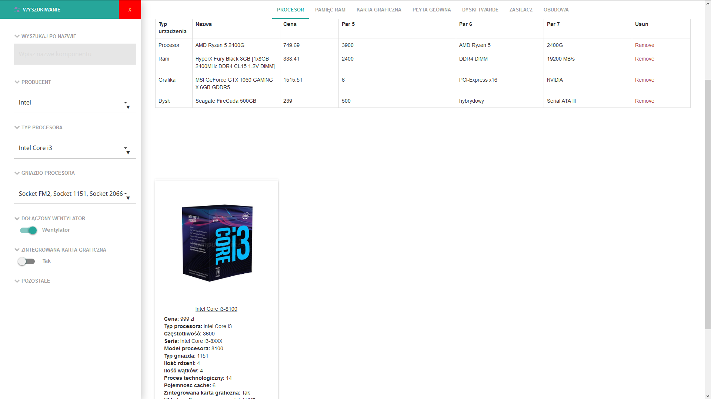
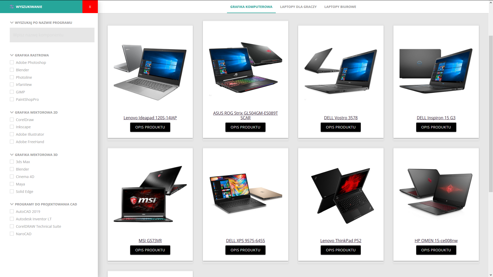
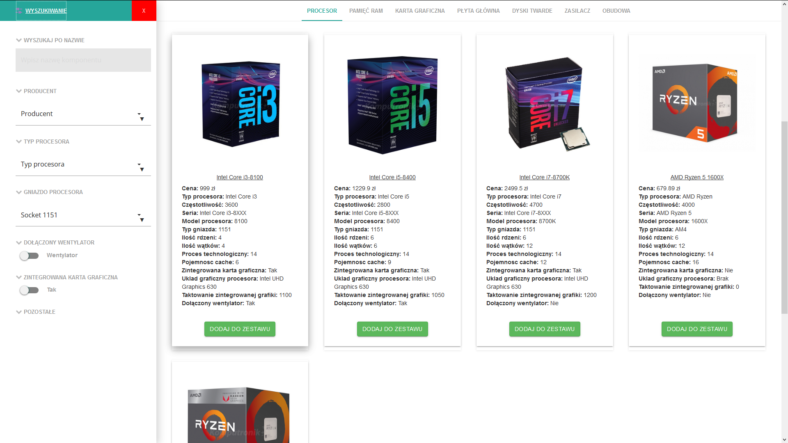

# Online computer configurator
Created using:
* [Materialize] - based on Starter Template.
* [PHP] - customer session and choosing an item.
* [MySQL] - database.
* [jQuery] - filter.
* [Content Filter] -  a slide-in filter panel.

### Installation

This page requires XAMPP to run. Install it and start the server. Using localhost to create database **online_shop** and use it 
```sh
CREATE DATABASE online_shop;
USE online_shop;
```
and then import **online_shop.sql**

### About page
The first part of this page is for user who want choose laptop is intended for a specific purpose.
 
 
The second part of this page is for user who want choose all components for their computers. This configurator checks if the components are compatible and makes it impossible to choose incompatible component.
 
 
 You can filter all components using left panel.
  
 
### Page appearance
**Page for beginners**
 

**Advanced wizard**
 

[jQuery]: <http://jquery.com>
[Materialize]: <https://materializecss.com/>
[Content Filter]:  <https://codyhouse.co/gem/content-filter>
